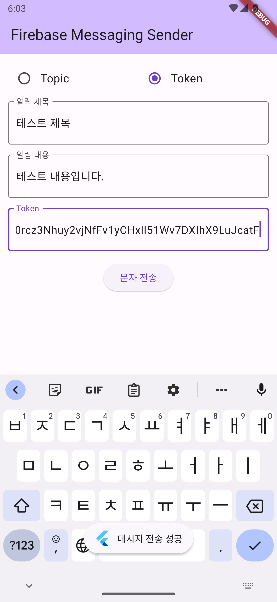
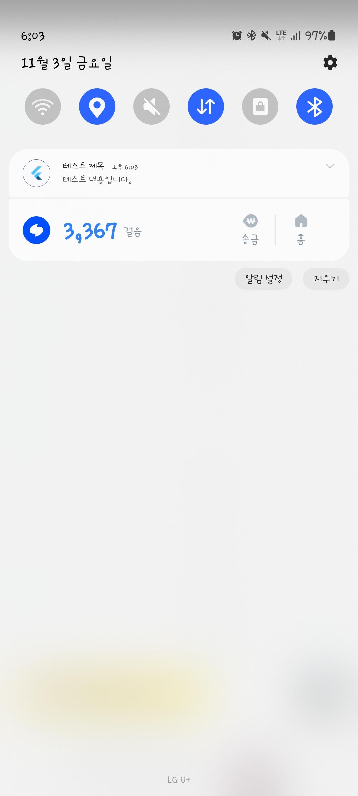

# FCM-test

> 이 프로젝트는 Flutter를 활용하여 Firebase Cloud Messaging (FCM)을 테스트하는 어플리케이션입니다.

## 프로젝트 설명

FCM-test 프로젝트는 두 부분으로 나뉩니다: "receiver"와 "sender." 이 두 부분은 FCM 메시지를 수신하고 보내는 데 사용됩니다. "receiver" 앱은 메시지를 받는 쪽이며 "sender" 앱은 메시지를 발신하는 쪽입니다.

## 프로젝트 결과

|                    전송                    |                     수신                     |
| :----------------------------------------: | :------------------------------------------: |
|  |  |

### 라이센스

이 프로젝트는 MIT 라이센스 하에 배포됩니다. 자세한 정보는 LICENSE 파일을 참고하세요.

### 기여

기여는 언제나 환영합니다. 어떠한 형태의 기여도 감사히 받아들이겠습니다
